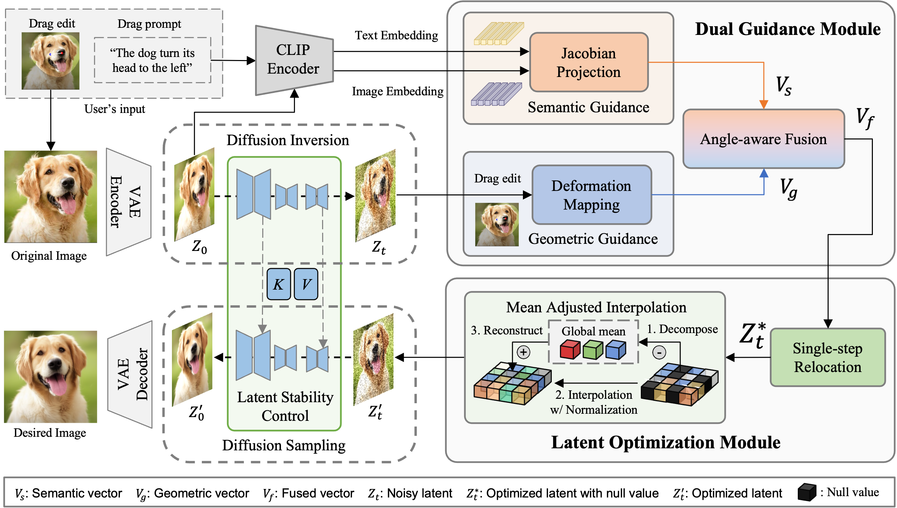

<p align="center">
  <h1 align="center">Dragonite: Single-Step Drag-based Image Editing with Geometric-Semantic Guidance</h1>
  <br>
  <div align="center">
    
  </div>
  <br>
</p>


## Installation

To install the required libraries, simply run the following command:
```
conda env create -f environment.yaml
conda activate dragonite
```

## Config
If you want download huggingface weights in local, you should download *runwayml/stable-diffusion-v1-5* and *SimianLuo/LCM_Dreamshaper_v7*.
- ```Suggestion 1```: It is suggested that download the model into the directory "local\_pretrained\_models";
- ```Suggestion 2```: *runwayml/stable-diffusion-v1-5* might not exist in huggingface, but can be found in other websites like [gitee](https://ai.gitee.com/hf-models/runwayml/stable-diffusion-v1-5/tree/main). 


## Run Dragonite
To start with, in command line, run the following to start the gradio user interface:
```
python drag_ui.py
```


## Acknowledgement
The code is built based on DragDiffusion and diffusers, thanks for their outstanding work!
