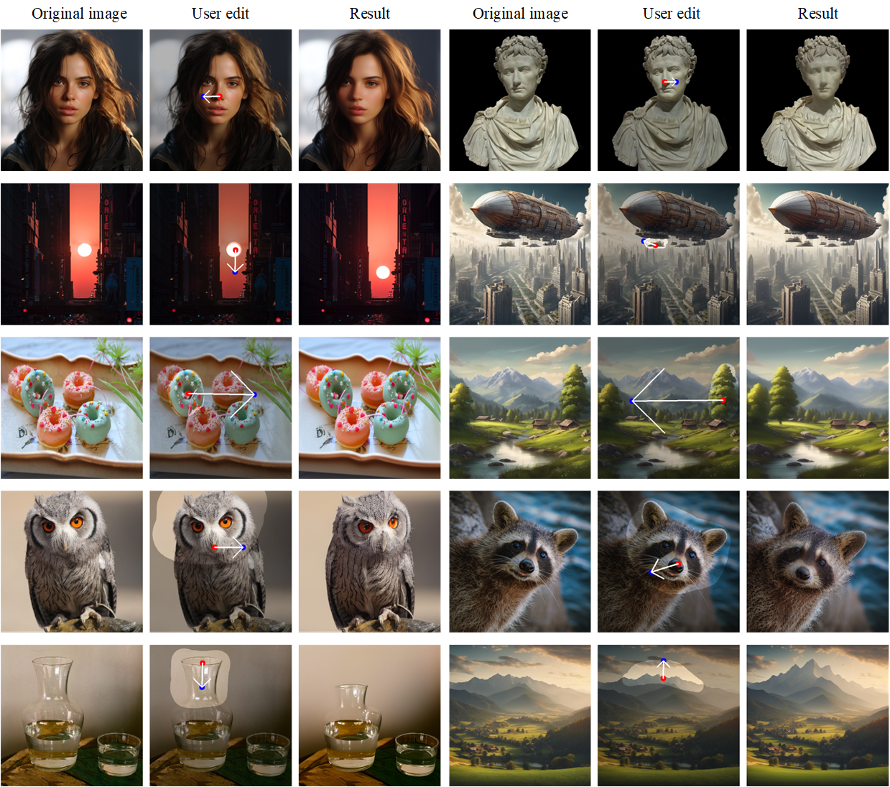
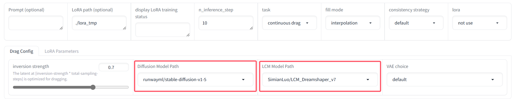

[NIPS 2024] Official code for FastDrag
<p align="center">
  <h1 align="center">FastDrag: Manipulate Anything in One Step</h1>
  <p align="center">
    <a href=""><strong>Xuanjia Zhao</strong></a>
    &nbsp;&nbsp;
    <a href="https://scholar.google.com/citations?hl=en&user=wf60G1sAAAAJ"><strong>Jian Guan</strong></a>
    &nbsp;&nbsp;
    <strong>Congyi Fan</strong>
    &nbsp;&nbsp;
    <strong>Dongli Xu</strong>
    &nbsp;&nbsp;
    <br>
    <a href="https://linyou.github.io/"><strong>Youtian Lin</strong></a>
    &nbsp;&nbsp;
    <strong>Haiwei Pan</strong>
    &nbsp;&nbsp;
    <a href="https://scholar.google.com/citations?hl=en&user=O51mMKgAAAAJ"><strong>Pengming Feng</strong></a>
  </p>
  <br>
  <p align="center">
    <a href="https://arxiv.org/abs/2405.15769"></a>
    <a href="https://fastdrag-site.github.io/"></a>
    <!-- <a href=""></a> -->
  </p>
  <div align="center">
    
  </div>
  <div align="center">
    
  </div>
  <!-- <div align="center">
    <video controls width="700">
        <source src="https://fastdrag-site.github.io/program.mp4" type="video/mp4" />
    </video>
  </div> -->
  <br>
</p>


## Installation

To install the required libraries, simply run the following command:
```
conda env create -f environment.yaml
conda activate fastdrag
```

## Config
If you want download huggingface weights in local, you should download *runwayml/stable-diffusion-v1-5* and *SimianLuo/LCM_Dreamshaper_v7*.
- ```Suggestion 1```: It is suggested that download the model into the directory "local\_pretrained\_models";
- ```Suggestion 2```: *runwayml/stable-diffusion-v1-5* might not exist in huggingface, but can be found in other websites like [gitee](https://ai.gitee.com/hf-models/runwayml/stable-diffusion-v1-5/tree/main). 

Then you can set path in config as below:



## Run Fastdrag
To start with, in command line, run the following to start the gradio user interface:
```
python drag_ui.py
```
For users struggling in loading models from huggingface due to internet constraint, please run:
```
sh run_drag.sh
```


## License
Code related to the FastDrag algorithm is under Apache 2.0 license.


## BibTeX
If you find our repo helpful, please consider leaving a star or cite our paper :)
```bibtex
@misc{zhao2024fastdrag,
        title={FastDrag: Manipulate Anything in One Step}, 
        author={Xuanjia Zhao and Jian Guan and Congyi Fan and Dongli Xu and Youtian Lin and Haiwei Pan and Pengming Feng},
        year={2024},
        eprint={2405.15769},
        archivePrefix={arXiv},
        primaryClass={cs.CV}
        }
```


<!-- ## 🔧Common Issues and Solutions
1) For users struggling in loading models from huggingface due to internet constraint, please 1) follow this [links](https://zhuanlan.zhihu.com/p/475260268) and download the model into the directory "local\_pretrained\_models"; 2) Run "drag\_ui.py" and select the directory to your pretrained model in "Algorithm Parameters -> Base Model Config -> Diffusion Model Path". -->


## Acknowledgement
The code is built based on DragDiffusion and diffusers, thanks for their outstanding work!

## Notice
For the fisrt time to run, it may be slow, but it will perform normally afterwards.
